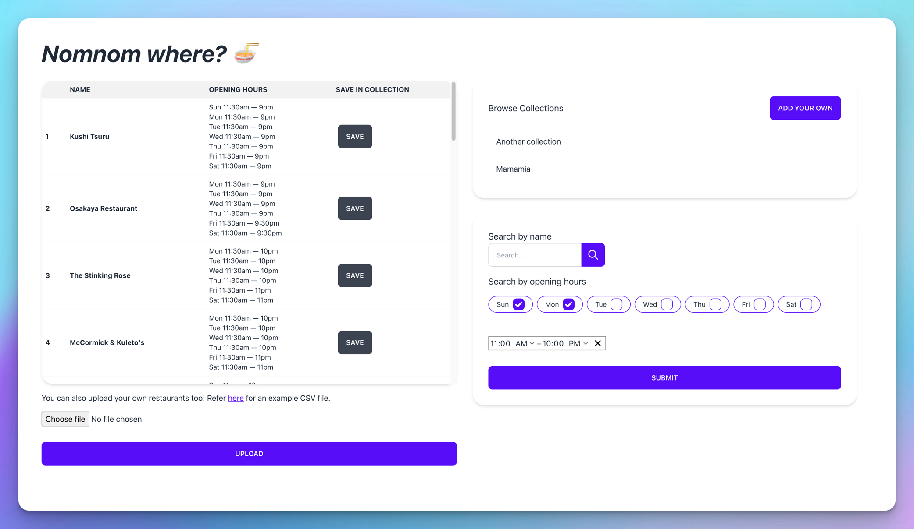

# nomnomwhere

This is a fullstack application built using Vite and deployed on Vercel.

-   Frontend: ReactJS

-   Backend: NodeJS, Express, Supabase (Postgres)

> This is a handy project for folks to learn how to deploy standalone frontend & backend apps in a single project onto Vercel, as usually NextJS apps is usually the way to do it for deployment to Vercel. However, in teams that are not familiar with NextJS, this is a nice alternative.

## Features

Frontend

-   Search Filters based on datetime, name
-   Upload CSV functionality. Tested the uploading & insertion to DB with this [sample csv](api/sampleFile.csv), containing 2k+ records.
-   Browse and add public collections
-   Add restaurants to the collections

Backend

-   Parse CSV records and upload them into DB
    -   Mapper for mapping opening hours input string (2nd column in .csv) into JSON, covered by tests
    -   Able to map all records in the [sample csv](api/sampleFile.csv).
-   API routes for creating/getting restaurants and collections
